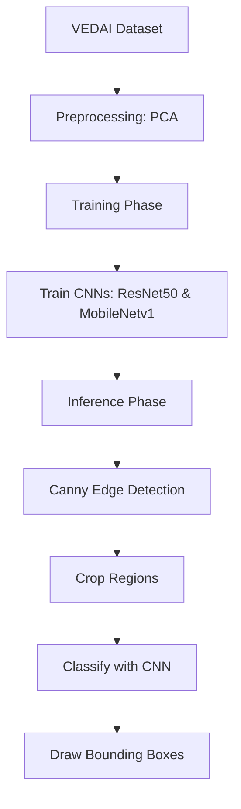

# Vehicle Detection from Aerial Imagery Using PCA and Deep Learning

## Overview

Detecting small vehicles in aerial imagery presents significant challenges due to cluttered backgrounds and minimal target sizes. Combining Principal Component Analysis (PCA) for effective dimensionality reduction with advanced deep learning techniques significantly improves detection performance. The approach simplifies feature extraction, reduces computational complexity, and enhances accuracy. Specifically, CNN architectures ResNet50 and MobileNetv1 are assessed for their effectiveness on the VEDAI dataset, demonstrating notable improvements when integrated with PCA preprocessing.

## Motivation

Vehicle detection from aerial imagery is crucial in various fields like urban planning and surveillance. Detecting small vehicles poses specific difficulties due to their minimal spatial footprints and visual similarity to surrounding structures.

* Existing CNN-based models face limitations in detecting subtle features in cluttered backgrounds.
* PCA is introduced as a preprocessing step to enhance detection accuracy by reducing irrelevant visual noise.

## Dataset and Preprocessing

* The VEDAI dataset includes annotated RGB aerial images.
* Preprocessing involves converting images to grayscale, flattening them, and applying PCA.
* PCA reduces dimensions to approximately 100 principal components, minimizing computational overhead and emphasizing meaningful features.

## Methodology

The detection pipeline is structured into two critical phases: the training and inference phases. During the **Training Phase**, the process begins with manually extracting and labeling vehicle and non-vehicle samples from the dataset. Subsequently, PCA is applied to these samples, significantly reducing the dimensionality and highlighting essential vehicle characteristics. The dimensionally reduced data is then used to train the CNN architectures—ResNet50 and MobileNetv1—enabling the networks to learn distinguishing features efficiently.

In the subsequent **Inference Phase**, the focus shifts to accurately identifying vehicles within new aerial imagery. Initially, potential vehicle regions are located using the Canny edge detection method, a technique well-suited for isolating regions of interest due to its precision in edge localization. These identified regions are cropped and individually classified using the previously trained CNN models. Finally, bounding boxes are drawn around the positively classified regions, clearly marking detected vehicles for easy interpretation and further analysis.

### Methodology Flow Diagram

## Model Architectures

* **MobileNetv1**: Lightweight but prone to performance issues due to the absence of skip connections.
* **ResNet50**: Utilizes residual connections, preserving gradient flow, particularly beneficial for detecting subtle visual cues in deeper layers.

## Experimental Results and Insights

* PCA preprocessing notably improves detection accuracy.
* Without PCA, models frequently misclassify similar-looking structures (e.g., chimneys as vehicles).
* MobileNetv1 achieved 76.25% accuracy with PCA.
* ResNet50 significantly outperformed MobileNetv1 with an accuracy of 85.2% after PCA preprocessing.

These results highlight the efficacy of integrating PCA with deep learning, underscoring the value of residual connections in improving model accuracy.

## Discussion

The strategic integration of PCA with modern neural networks proves particularly effective in managing dense but sparsely annotated datasets. PCA helps neural networks focus on critical features by reducing irrelevant information, enhancing the overall efficiency and effectiveness of the detection task. Moreover, architectural choices within neural networks significantly influence performance outcomes. Specifically, residual connections, as utilized in ResNet architectures, play a crucial role in maintaining robust feature propagation throughout deeper layers. This ensures the detection model remains accurate, especially in tasks involving the identification of subtle and complex visual cues.

## Limitations and Future Work

* Current PCA preprocessing discards valuable color information.
* Future research should explore color-preserving dimensionality reduction techniques or multi-channel reduction methods like t-SNE or UMAP.
* Incorporating infrared data could further enhance detection in challenging visibility conditions.
* Potential exploration of transfer learning with geographically diverse datasets and lighter models suitable for real-time applications.

## Citation

If you use this work or build upon it, please cite:

**Ayush Kumar et al., "Vehicle Detection from Aerial Imagery Using Principal Component Analysis and Deep Learning", Springer, March 2023. DOI: 10.1007/978-3-031-27499-2_12**

