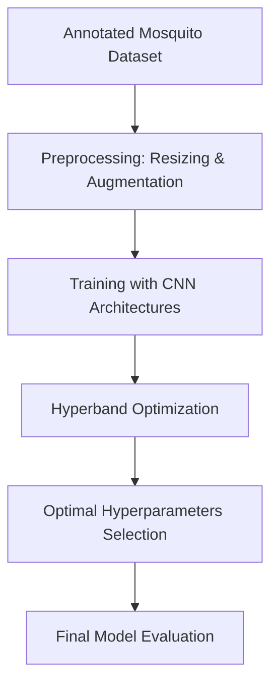

---

id: mosquito-classification-deep-learning
title: Mosquito on Human Skin Classification Using Deep Learning
date: 2023-09-29
summary: Introduces a deep learning pipeline using EfficientNetB7 combined with Hyperband hyperparameter tuning for precise mosquito species classification on human skin. Emphasizes automated model optimization to enhance accuracy and reduce manual effort.
tags: [CNN, Transfer Learning, Hyperparameter Tuning, EfficientNetB7, Image Classification, Public Health]

--------------

# Mosquito on Human Skin Classification Using Deep Learning

## Overview

Accurate identification of mosquito species on human skin significantly contributes to public health efforts by enabling targeted vector control measures. Leveraging advanced deep learning techniques, this work develops an automated model capable of classifying mosquito species and their conditions (alive, dead, damaged) directly from skin images. EfficientNetB7 and other convolutional neural networks (CNNs) are explored and optimized through hyperparameter tuning with the Hyperband strategy.

## Motivation

Mosquitoes are major vectors for diseases like malaria, Zika virus, and West Nile virus. Conventional mosquito monitoring methods are often resource-intensive and prone to human error. Developing automated classification systems using deep learning can address these limitations, providing rapid, accurate, and scalable solutions.

## Dataset and Preprocessing

* The dataset includes images of mosquito species (Aedes aegypti, Aedes albopictus, and Culex quinquefasciatus) in various states (landing, dead, damaged) on diverse human skin backgrounds.
* Original images (5184x3456 pixels) are resized to 224x224 pixels.
* Data augmentation techniques are applied to enhance model generalization and robustness.

## Methodology

The proposed pipeline involves two main stages: training and hyperparameter optimization.

### Training Phase

* Utilize pretrained CNN architectures (EfficientNetB7, Xception, ResNet50) for initial feature extraction.
* Apply deep convolutional neural networks to classify mosquito species based on extracted features.

### Hyperparameter Optimization Phase

* Implement Hyperband optimization to systematically fine-tune hyperparameters such as learning rates, dropout rates, activation functions, and layer configurations.
* Automate hyperparameter tuning using Keras Tuner, enhancing model accuracy and reducing training time.

### Methodology Flow Diagram

## Model Architectures

* **EfficientNetB7**: Demonstrates the highest accuracy through extensive hyperparameter optimization.
* **Simple DCNN**: Serves as a baseline model, achieving reasonable accuracy with fewer computational resources.

## Experimental Results and Insights

* EfficientNetB7 achieved the highest accuracy (91%), significantly outperforming simpler CNNs (86%) and other pretrained models.
* Hyperparameter tuning notably enhanced model performance, highlighting its essential role in deep learning workflows.
* Pretrained model performance improved substantially when additional dense layers were incorporated.

## Discussion

Integrating hyperparameter optimization via Hyperband significantly boosted the classification accuracy and reduced training complexity. This approach effectively addressed typical issues like overfitting and computational inefficiency, demonstrating the superiority of automated tuning over manual methods. Furthermore, deep learning architectures pretrained on large-scale datasets showed remarkable adaptability to the specific task of mosquito classification on human skin.

## Limitations and Future Work

* Dataset diversity remains limited, potentially affecting model generalizability across different skin tones.
* Future work could involve exploring spectral image preprocessing techniques or additional feature extraction methods.
* Implementation of ensemble methods or boosting techniques may further enhance accuracy and robustness.

## Citation

Please cite this work if you use or reference it in your research:

**C S Ayush Kumar et al., "Mosquito on Human Skin Classification Using Deep Learning", Springer, January 2023. DOI: 10.1007/978-3-031-40688-1\_9**

