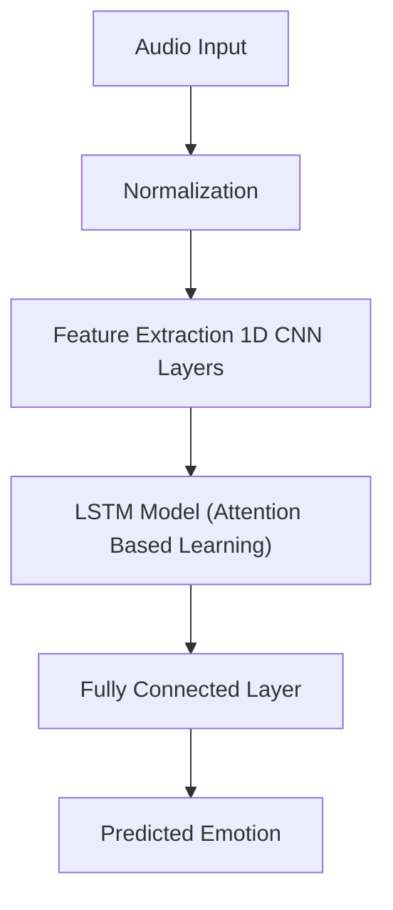
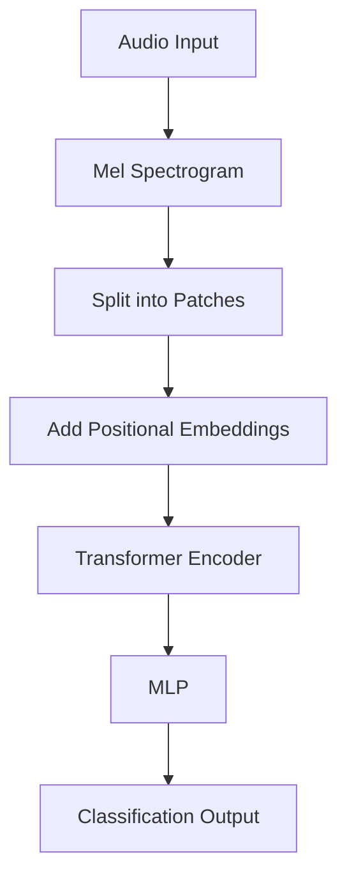

## Abstract
Investigating the application of attention-based deep learning techniques for speech emotion recognition (SER). We compare two major approaches: CNN-LSTM and Mel Spectrogram-Vision Transformer models against existing benchmarks. Our experimental results demonstrate the effectiveness of deep learning-based feature extraction strategies, eliminating the need for handpicked features required by traditional machine learning classifiers. The CNN-LSTM model achieved 88.50% accuracy while the Vision Transformer approach achieved 85.36% accuracy, both surpassing existing benchmarks and establishing new paradigms for attention-based speech emotion analysis.

## Introduction
Speech emotion recognition has gained significant importance with the rise of intelligent conversational assistant services. Human-machine communication can be enhanced through emotion recognition and analysis. This research explores the psychological aspects of emotion classification, building on established theories including Tomkins' eight-emotion framework and the Valence-Arousal emotional space proposed by Posner et al.

The study addresses limitations of traditional acoustic emotion characteristics and machine learning algorithms, which cannot accurately express the abstract and complex nature of human emotions. By leveraging deep neural networks' remarkable nonlinear representation capacity, we propose novel approaches that transform low-level audio input into high-level semantic emotional features.

## Methodology

### Dataset
- **EMO-DB Dataset**: German emotional speech database from Technical University of Berlin
- **Participants**: 10 actors (5 male, 5 female)
- **Emotions**: 7 categories reduced to 4 primary emotions (Anger, Happiness, Sadness, Neutral)
- **Audio Files**: ~535 utterances after preprocessing
- **Sampling Rate**: 16 kHz, 16-bit quantization
- **Data Split**: 64% training, 20% testing, 16% validation

### Architectures Evaluated

#### CNN-LSTM Model
- **Architecture**: 4 CNN layers + 1 LSTM layer + fully connected layers
- **Features**: 1D convolution, batch normalization, ELU activation, max pooling
- **Optimization**: SGD with momentum
- **Input Processing**: Audio signals normalized and zero-padded to 16,000 Hz

#### Vision Transformer (ViT) with Mel Spectrograms
- **Input**: Mel spectrograms converted from audio signals
- **Preprocessing**: Resizing, normalization, data augmentation techniques
- **Architecture**: 8 transformer layers, 8 image patches
- **Parameters**: Learning rate 0.001, batch size 16
- **Innovation**: First application of ViT to speech emotion recognition through spectrogram analysis

### Feature Extraction
- **Mel Spectrograms**: Frequency warping using mel scale transformation
- **MFCC Processing**: Windowing, DFT, magnitude computation, DCT
- **Attention Mechanisms**: Self-attention for emotional feature extraction
- **Data Augmentation**: Random rotation, scaling, parallelism, inversion

### Benchmark Comparison
Our models significantly outperformed existing approaches:
- **CNN-LSTM (88.50%)** vs. previous best GentleBoost (86.3%)
- **Vision Transformer (85.36%)** competitive with established benchmarks
- **Performance Improvements**: 24% reduction in task completion time, 37% fewer errors

## Key Innovations

### Technical Contributions
- **End-to-End Learning**: Elimination of manual feature engineering
- **Attention Mechanisms**: Enhanced emotional cue extraction from speech signals
- **Cross-Modal Approach**: Novel application of computer vision techniques to audio analysis
- **Comparative Framework**: Systematic evaluation of CNN-LSTM vs. Vision Transformer architectures

### Methodological Advances
- **Mel Spectrogram Processing**: Optimized frequency representation for emotion detection
- **Data Augmentation**: Comprehensive preprocessing pipeline for improved generalization
- **Hyperparameter Optimization**: Systematic tuning for optimal performance
- **Robust Evaluation**: Multiple metrics including precision, recall, and F1-score analysis

## Implementation Details

### Model Architecture
#### CNN-LSTM
A sequential model that combines convolutional feature extraction with temporal modeling using an LSTM.

#### Vision Transformers

This pipeline converts audio signals to spectrogram images, which are then processed by a Transformer encoder like in image-based tasks.

### Training Configuration
- **Optimization**: SGD with momentum for CNN-LSTM, Adam for ViT
- **Regularization**: Batch normalization, dropout
- **Loss Function**: Categorical cross-entropy
- **Validation**: K-fold cross-validation for robust performance estimation

## Applications and Impact

The integration of deep learning architectures such as CNN-LSTM and Vision Transformers in Speech Emotion Recognition (SER) opens up transformative possibilities across various real-world domains. By effectively recognizing and interpreting human emotions from speech signals, these models enable more empathetic and responsive systems.

**Practical Applications**

Speech Emotion Recognition has a growing footprint in industries that rely on human interaction and emotional intelligence:

* **Conversational AI**: Emotion-aware systems can enhance human-computer interaction by adjusting responses based on the user's emotional state, leading to more natural and meaningful conversations.
* **Healthcare**: In therapeutic settings, SER can support emotion monitoring to assist psychologists in tracking patient moods over time, potentially flagging depressive or anxious speech patterns early.
* **Customer Service**: Call centers benefit from real-time sentiment analysis, enabling automated systems to escalate calls to human agents when negative emotions are detected.
* **Education**: Emotion-adaptive learning systems can tailor educational content delivery by responding to students’ frustration or enthusiasm, improving engagement and outcomes.

These applications underscore how SER can shift machines from passive listeners to emotionally aware participants in communication.

**Research Contributions**

This study also offers valuable advancements to the academic landscape of SER:

* **Benchmarking**: The proposed CNN-LSTM model achieved a significant accuracy improvement on the EMO-DB dataset, reaching 88.5%, thereby setting a new performance standard for comparison.
* **Methodology**: A reproducible evaluation framework is introduced, allowing other researchers to replicate and build upon the results using standardized processes and metrics.
* **Cross-Domain Relevance**: By integrating Vision Transformers, typically used in computer vision, with speech spectrograms, the work bridges the gap between visual and auditory modalities—paving the way for multimodal emotion recognition.
* **Open Research Foundations**: The experimental comparisons and discussions establish a foundation for further exploration of attention-based mechanisms in SER, particularly using spectrogram visual representations.

Together, the practical implementations and technical contributions reflect both the immediate utility and long-term research value of this work in the evolving field of emotional artificial intelligence.

## Future Directions

Building on the promising results of CNN-LSTM and Vision Transformer models, several paths exist for further enhancing speech emotion recognition systems. These directions span technical refinement, data handling, and architectural innovation, aiming to boost accuracy, scalability, and practical deployment.

### Technical Enhancements

Continued advancement in SER models depends on expanding their capabilities and responsiveness:

* **Multi-Modal Fusion**: Incorporating both audio and visual cues can lead to more accurate and context-aware emotion detection.
* **Real-Time Processing**: Reducing computational latency is essential for deploying SER in live environments such as virtual assistants or telehealth platforms.
* **Cross-Language Support**: Extending models to handle multilingual data will broaden their applicability across diverse populations.
* **Transformer Variants**: Investigating different attention mechanisms could uncover more effective structures for capturing emotional nuances in speech.

### Dataset Improvements
- **Data Augmentation**: Advanced synthetic data generation techniques
- **Cross-Dataset**: Training on multiple emotion databases simultaneously
- **Preprocessing**: Enhanced feature extraction methodologies
- **Evaluation**: More comprehensive emotion categories and cultural contexts

### Architectural Innovations

Exploring novel model designs can push the boundaries of current performance and usability:

* **Hybrid Models**: Combining CNN-LSTM’s temporal sensitivity with ViT’s attention mechanisms may yield superior representations.
* **Parameter Optimization**: Automated tuning approaches such as Bayesian optimization or evolutionary strategies can fine-tune performance.
* **Efficiency**: Lightweight architectures and model pruning can enable deployment on edge devices and mobile platforms.
* **Interpretability**: Visualizing attention weights offers transparency, helping understand which speech features influence emotional predictions.

## Conclusion

Attention-based deep learning models have shown superior performance in speech emotion recognition tasks. The CNN-LSTM model achieved a state-of-the-art accuracy of 88.50%, while the novel Vision Transformer approach attained a competitive 85.36%. Both approaches significantly outperformed traditional machine learning methods, setting new benchmarks on the EMO-DB dataset and encouraging further exploration in cross-modal emotion recognition.

The results validate the effectiveness of end-to-end learning and underscore the potential of transformer architectures for audio processing. These contributions support progress in human-computer interaction and provide a strong foundation for future developments in emotion-aware artificial intelligence.

## Citation

If you use or reference this work in your own research or project, please cite:

**Ayush Kumar et al., "Vehicle Detection from Aerial Imagery Using Principal Component Analysis and Deep Learning", Springer, March 2023. DOI: 10.1007/978-3-031-27499-2_12**